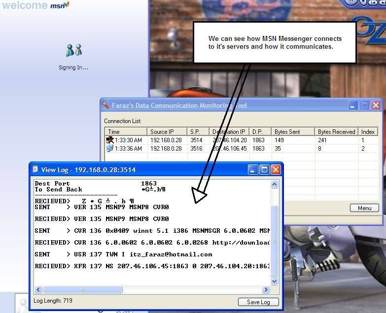



## Monitor your internet Data Communication

### Description

Here it is... a program through which you can monitor how other program communicate through the internet. It creates a log of all the requests to servers and their replys. Of course this works only behind a proxy. Other programs connect to this program and this program further connects to a proxy server. And so in between, you can monitor what data is transmitted and received.

It has many good uses: for eg. you may want to know how to send HTTP requests to a server, in that case you can use this program to monitor IE.

plz vote :D
 
### More Info
 

             |
---                |---
**Submitted On**   |2003-10-23 02:01:12
**By**             |[Faraz Azhar](https://github.com/Planet-Source-Code/PSCIndex/blob/master/ByAuthor/faraz-azhar.md)
**Level**          |Advanced
**User Rating**    |5.0 (20 globes from 4 users)
**Compatibility**  |VB 5\.0, VB 6\.0
**Category**       |[Internet/ HTML](https://github.com/Planet-Source-Code/PSCIndex/blob/master/ByCategory/internet-html__1-34.md)
**World**          |[Visual Basic](https://github.com/Planet-Source-Code/PSCIndex/blob/master/ByWorld/visual-basic.md)
**Archive File**   |[Monitor\_yo16621010222003\.zip](https://github.com/Planet-Source-Code/faraz-azhar-monitor-your-internet-data-communication__1-49396/archive/master.zip)

